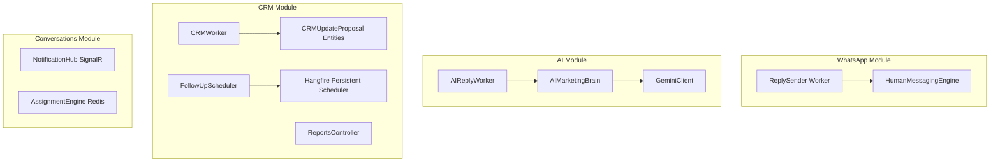

# Skill: Phase 2 - AI Intelligence & CRM Foundation

## Overview
This skill implements Phase 2 of the Smart Customer Core, extending the system with AI features (structured replies, sentiment analysis, entity extraction), typing simulation, Redis-based agent presence/routing, Hangfire persistent task scheduling, SignalR real-time notification push, and reporting telemetry.

---

## Architecture & Services

### 1. Modules & Components



### 2. Service Definitions

- **`IAIMarketingBrain`** (`AIMarketingBrain.cs`):
  - Formulates structured prompt instructions for Gemini.
  - Returns `MarketingAnalysisResult` parsing intent, sentiment, reply style, extracted customer metadata entities, and AI confidence score.
- **`IHumanMessagingEngine`** (`HumanMessagingEngine.cs`):
  - Splits outbound messages by sentences/paragraphs.
  - Calculates dynamic human-like typing delays based on text length.
- **`IAssignmentEngine`** (`AssignmentEngine.cs`):
  - Manages agent presence under Redis key format `project:{projectId}:agent:{agentId}:presence`.
  - Routes conversations to the active agent with the least assigned conversations.
- **`FollowUpScheduler`** (`FollowUpScheduler.cs`):
  - Configures Hangfire persistent DB job storage.
  - Registers recurring Hangfire cron jobs to automatically check and mark overdue follow-ups as `Missed` and recalculate active lead scores.
- **`NotificationHub`** (`NotificationHub.cs`):
  - Broadcasts SignalR push alerts to tenant connection groups.

---

## Configuration & Protocols

### 1. Nginx WebSockets Configuration
WebSocket connections are proxied to the SignalR hub in `/hubs/` with correct headers in `nginx/default.conf`:
```nginx
location /hubs/ {
    proxy_pass http://backend:5000;
    proxy_http_version 1.1;
    proxy_set_header Upgrade $http_upgrade;
    proxy_set_header Connection "Upgrade";
    proxy_set_header Host $host;
}
```

### 2. WebSocket JWT Authentication
SignalR reads tokens from query strings instead of standard authorization headers. `TenantMiddleware` extracts the tenant context by checking the query string `access_token` parameter:
```csharp
var token = context.Request.Query["access_token"].ToString();
```

---

## Verification & Testing

Verify execution of the Phase 2 component suite using `pytest`:

```bash
# Run all Phase 2 tests
.venv/bin/pytest tests/phase_2/ -v --tb=short

# Run the complete test suite
make test-all
```

### Phase 2 Test Index
- [test_ai_marketing_brain.py](file:///Users/mazenelsbagh/mazen%20mac/apps/smart%20whatsapp/tests/phase_2/test_ai_marketing_brain.py): Validates structured Gemini prompting and mock JSON replies.
- [test_assignment.py](file:///Users/mazenelsbagh/mazen%20mac/apps/smart%20whatsapp/tests/phase_2/test_assignment.py): Verifies least-workload routing and presence heartbeat.
- [test_crm_auto_update.py](file:///Users/mazenelsbagh/mazen%20mac/apps/smart%20whatsapp/tests/phase_2/test_crm_auto_update.py): Checks CRM proposals generation and automatic high-confidence updates.
- [test_human_messaging.py](file:///Users/mazenelsbagh/mazen%20mac/apps/smart%20whatsapp/tests/phase_2/test_human_messaging.py): Asserts sentences splitting and message chunk delivery.
- [test_intent_sentiment.py](file:///Users/mazenelsbagh/mazen%20mac/apps/smart%20whatsapp/tests/phase_2/test_intent_sentiment.py): Verifies lead scores update on positive/negative sentiment signals.
- [test_notifications.py](file:///Users/mazenelsbagh/mazen%20mac/apps/smart%20whatsapp/tests/phase_2/test_notifications.py): Asserts SignalR client push alerts delivery.
- [test_reports.py](file:///Users/mazenelsbagh/mazen%20mac/apps/smart%20whatsapp/tests/phase_2/test_reports.py): Checks reporting telemetry API outputs.
- [test_scheduler.py](file:///Users/mazenelsbagh/mazen%20mac/apps/smart%20whatsapp/tests/phase_2/test_scheduler.py): Confirms Hangfire recurring job execution.
