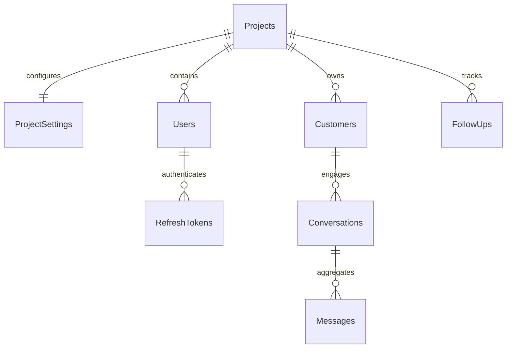

# Data Model Specification: Core Foundation

## 1. Database Schema Overview

Smart Customer Core uses a relational PostgreSQL database. To enforce multi-tenancy, all primary operational tables contain a `ProjectId` column. Below are the key entity designs.

---

## 2. Entities & Table Definitions

### 2.1 Projects
- **Table Name**: `Projects`
- **Fields**:
  - `Id`: `UUID` (Primary Key)
  - `Name`: `VARCHAR(100)` (Required)
  - `CreatedAt`: `TIMESTAMP` (UTC, Default: Now)
  - `UpdatedAt`: `TIMESTAMP` (UTC, Default: Now)

### 2.2 ProjectSettings
- **Table Name**: `ProjectSettings`
- **Fields**:
  - `ProjectId`: `UUID` (Primary Key, Foreign Key -> `Projects.Id`, cascade delete)
  - `AiAutoReplyEnabled`: `BOOLEAN` (Default: false)
  - `Timezone`: `VARCHAR(50)` (Default: "UTC")
  - `GeminiApiKey`: `VARCHAR(255)` (Optional, encrypted at rest)
  - `UpdatedAt`: `TIMESTAMP` (UTC, Default: Now)

### 2.3 Users
- **Table Name**: `Users`
- **Fields**:
  - `Id`: `UUID` (Primary Key)
  - `Email`: `VARCHAR(255)` (Required, Unique index)
  - `PasswordHash`: `VARCHAR(255)` (Required)
  - `Role`: `VARCHAR(50)` (Required - Owner, Admin, Agent, etc.)
  - `ProjectId`: `UUID` (Required, Foreign Key -> `Projects.Id`)
  - `CreatedAt`: `TIMESTAMP` (UTC)
  - `LastLogin`: `TIMESTAMP` (UTC, Nullable)

### 2.4 RefreshTokens
- **Table Name**: `RefreshTokens`
- **Fields**:
  - `Id`: `UUID` (Primary Key)
  - `UserId`: `UUID` (Required, Foreign Key -> `Users.Id`, cascade delete)
  - `Token`: `VARCHAR(255)` (Required, Unique index)
  - `ExpiresAt`: `TIMESTAMP` (UTC)
  - `CreatedAt`: `TIMESTAMP` (UTC)
  - `RevokedAt`: `TIMESTAMP` (UTC, Nullable)

### 2.5 Customers
- **Table Name**: `Customers`
- **Fields**:
  - `Id`: `UUID` (Primary Key)
  - `ProjectId`: `UUID` (Required, Foreign Key -> `Projects.Id`)
  - `PhoneNumber`: `VARCHAR(30)` (Required)
  - `Name`: `VARCHAR(100)` (Optional)
  - `City`: `VARCHAR(100)` (Optional)
  - `LeadScore`: `INTEGER` (Default: 0)
  - `Tags`: `TEXT[]` (String array for grouping tags)
  - `Notes`: `TEXT` (Optional)
  - `CreatedAt`: `TIMESTAMP` (UTC, Default: Now)
- **Indexes**:
  - Unique index: `(ProjectId, PhoneNumber)` to isolate contacts per tenant.

### 2.6 Conversations
- **Table Name**: `Conversations`
- **Fields**:
  - `Id`: `UUID` (Primary Key)
  - `ProjectId`: `UUID` (Required, Foreign Key -> `Projects.Id`)
  - `CustomerId`: `UUID` (Required, Foreign Key -> `Customers.Id`)
  - `Status`: `VARCHAR(50)` (Open, Pending, Resolved, Closed)
  - `LastMessageTimestamp`: `TIMESTAMP` (UTC)
  - `CreatedAt`: `TIMESTAMP` (UTC, Default: Now)
- **Indexes**:
  - Index on `(ProjectId, Status)`

### 2.7 Messages
- **Table Name**: `Messages`
- **Fields**:
  - `Id`: `UUID` (Primary Key)
  - `ConversationId`: `UUID` (Required, Foreign Key -> `Conversations.Id`, cascade delete)
  - `ExternalMessageId`: `VARCHAR(255)` (Optional, unique WhatsApp message ID)
  - `Direction`: `VARCHAR(20)` (Incoming, Outgoing)
  - `Content`: `TEXT` (Required)
  - `MessageType`: `VARCHAR(20)` (Text, Image, Voice, Document)
  - `Timestamp`: `TIMESTAMP` (UTC)

### 2.8 FollowUps
- **Table Name**: `FollowUps`
- **Fields**:
  - `Id`: `UUID` (Primary Key)
  - `ProjectId`: `UUID` (Required, Foreign Key -> `Projects.Id`)
  - `CustomerId`: `UUID` (Required, Foreign Key -> `Customers.Id`)
  - `Details`: `TEXT` (Required)
  - `DueDate`: `TIMESTAMP` (UTC)
  - `Status`: `VARCHAR(20)` (Pending, Done, Missed)
  - `CreatedAt`: `TIMESTAMP` (UTC)

---

## 3. Relationships Diagram

