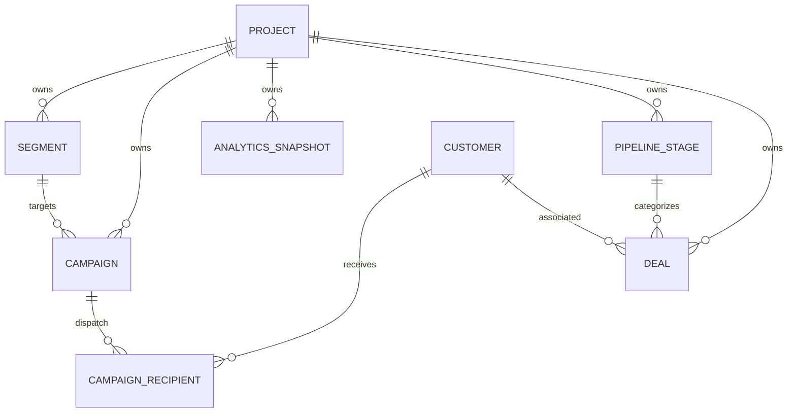

# Data Model: Campaigns, Advanced Analytics & Reporting

## Entities & Fields

### 1. Segment
Holds dynamic queries used to group customers based on metadata.

| Field | Type | Description | Constraints |
|-------|------|-------------|-------------|
| `Id` | `Guid` | Primary key | Unique, Not Null |
| `ProjectId` | `Guid` | Tenant isolation key | Not Null, Index |
| `Name` | `string` | Human-readable name of the segment | Max length 100, Not Null |
| `FilterCriteriaJson`| `string` | JSON payload containing query filter rules | Not Null |
| `CreatedAt` | `DateTimeOffset`| Date of creation | Not Null |

### 2. Campaign
Represents a bulk message broadcast event.

| Field | Type | Description | Constraints |
|-------|------|-------------|-------------|
| `Id` | `Guid` | Primary key | Unique, Not Null |
| `ProjectId` | `Guid` | Tenant isolation key | Not Null, Index |
| `Name` | `string` | Name of the campaign | Max length 150, Not Null |
| `SegmentId` | `Guid` | Target audience segment | Foreign Key to `Segment`, Not Null |
| `MessageTemplateA` | `string` | Primary template text with dynamic placeholders | Not Null |
| `MessageTemplateB` | `string` | Variant template text for A/B testing | Nullable |
| `Status` | `CampaignStatus`| Status of campaign (Enum) | Not Null, Default `Draft` |
| `ScheduledAt` | `DateTimeOffset`| Scheduled date/time for broadcast | Nullable |
| `StartedAt` | `DateTimeOffset`| Timestamp when broadcast started | Nullable |
| `CompletedAt` | `DateTimeOffset`| Timestamp when broadcast finished | Nullable |
| `SentCount` | `int` | Count of messages dispatched to API | Default 0 |
| `DeliveredCount` | `int` | Count of confirmed delivery receipts | Default 0 |
| `ReadCount` | `int` | Count of read receipts | Default 0 |
| `ResponseCount` | `int` | Count of customers responding within 24h | Default 0 |
| `CreatedAt` | `DateTimeOffset`| Date of creation | Not Null |
| `UpdatedAt` | `DateTimeOffset`| Date of last update | Not Null |

*CampaignStatus*: `Draft`, `Scheduled`, `Running`, `Paused`, `Completed`, `Cancelled`.

### 3. CampaignRecipient
Tracks delivery and response status for each customer in a campaign.

| Field | Type | Description | Constraints |
|-------|------|-------------|-------------|
| `Id` | `Guid` | Primary key | Unique, Not Null |
| `CampaignId` | `Guid` | Reference to parent campaign | Foreign Key, Not Null, Index |
| `CustomerId` | `Guid` | Reference to customer | Foreign Key, Not Null, Index |
| `Variant` | `string` | Segment variant assigned ("A" or "B") | Not Null, Max 5 |
| `Status` | `RecipientStatus`| Delivery status (Enum) | Default `Pending` |
| `SentAt` | `DateTimeOffset`| Timestamp when sent to WhatsApp API | Nullable |
| `DeliveredAt` | `DateTimeOffset`| Timestamp when delivered to user phone | Nullable |
| `ReadAt` | `DateTimeOffset`| Timestamp when read by customer | Nullable |
| `ErrorMessage` | `string` | Failure message if send failed | Nullable |

*RecipientStatus*: `Pending`, `Sent`, `Delivered`, `Read`, `Failed`, `Responded`.

### 4. AnalyticsSnapshot
Stores daily and weekly aggregated metrics.

| Field | Type | Description | Constraints |
|-------|------|-------------|-------------|
| `Id` | `Guid` | Primary key | Unique, Not Null |
| `ProjectId` | `Guid` | Tenant isolation key | Not Null, Index |
| `SnapshotDate` | `DateOnly` | Date of aggregation | Not Null, Index |
| `MetricType` | `string` | Metric identifier (e.g. `HandoffRate`) | Not Null, Max 50 |
| `MetricValue` | `decimal` | Numeric result value | Not Null |
| `MetadataJson` | `string` | JSON data representing categories or details | Nullable |

### 5. PipelineStage
Defines stages of the sales funnel.

| Field | Type | Description | Constraints |
|-------|------|-------------|-------------|
| `Id` | `Guid` | Primary key | Unique, Not Null |
| `ProjectId` | `Guid` | Tenant isolation key | Not Null, Index |
| `Name` | `string` | Stage name (e.g., New, Contacted, Won) | Max 50, Not Null |
| `Order` | `int` | Sequence order for visualization | Not Null |

### 6. Deal
Represents an active sales opportunity.

| Field | Type | Description | Constraints |
|-------|------|-------------|-------------|
| `Id` | `Guid` | Primary key | Unique, Not Null |
| `ProjectId` | `Guid` | Tenant isolation key | Not Null, Index |
| `CustomerId` | `Guid` | Customer associated with this deal | Foreign Key, Not Null |
| `Title` | `string` | Title/name of the deal | Max 150, Not Null |
| `Amount` | `decimal` | Monitory value of the deal | Not Null, Default 0 |
| `PipelineStageId` | `Guid` | Current stage in the pipeline | Foreign Key, Not Null |
| `Status` | `DealStatus` | Deal outcome state (Enum) | Not Null, Default `Open` |
| `CreatedAt` | `DateTimeOffset`| Creation timestamp | Not Null |
| `ClosedAt` | `DateTimeOffset`| Close timestamp (won or lost) | Nullable |

*DealStatus*: `Open`, `Won`, `Lost`.

## Relationships

