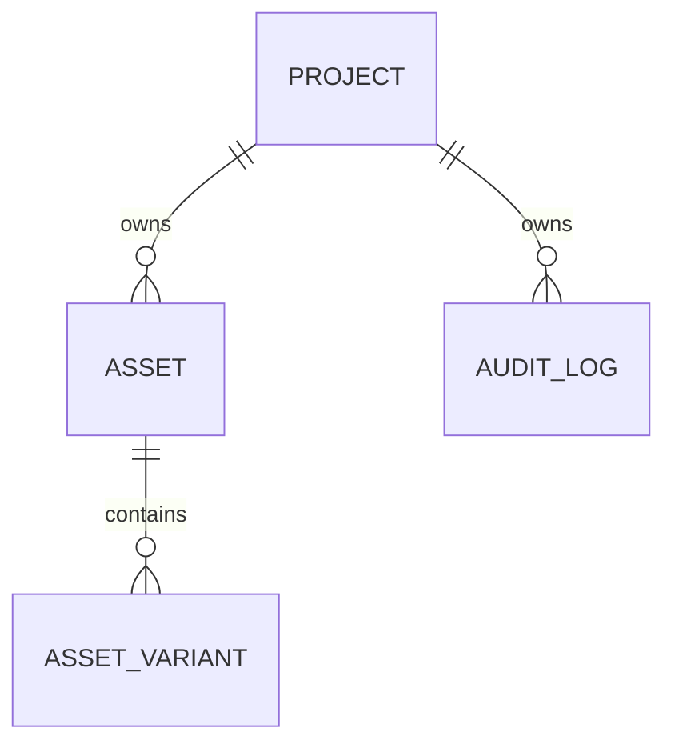

# Data Model: Shared Assets, Media Engine & Audit Trail

## Entities & Fields

### 1. Asset
Represents a primary uploaded media asset.

| Field | Type | Description | Constraints |
|-------|------|-------------|-------------|
| `Id` | `Guid` | Primary key | Unique, Not Null |
| `ProjectId` | `Guid` | Tenant isolation key | Not Null, Index |
| `FileName` | `string` | The original file name | Max length 255, Not Null |
| `ContentType` | `string` | MIME type of the file | Max length 100, Not Null |
| `FileSize` | `long` | Size in bytes | Not Null |
| `FileHash` | `string` | SHA-256 hash of file content | Max length 64, Not Null, Index |
| `StoragePath` | `string` | Path inside MinIO | Max length 500, Not Null |
| `ReferenceCount` | `int` | Number of references to this asset | Not Null, Default 1 |
| `UploadedBy` | `Guid` | User ID who uploaded | Not Null |
| `CreatedAt` | `DateTime` | Creation date | Not Null |
| `UpdatedAt` | `DateTime` | Last update date | Not Null |

### 2. AssetVariant
Represents transformed versions of a primary asset (e.g. thumbnails, WhatsApp compressed files).

| Field | Type | Description | Constraints |
|-------|------|-------------|-------------|
| `Id` | `Guid` | Primary key | Unique, Not Null |
| `AssetId` | `Guid` | Reference to parent asset | Foreign Key to `Asset`, Not Null, Index |
| `VariantType` | `AssetVariantType` | Type of variant (Enum) | Not Null |
| `FileSize` | `long` | Size in bytes | Not Null |
| `StoragePath` | `string` | Path inside MinIO | Max length 500, Not Null |
| `MetadataJson` | `string`| Dimensions or processing details | Nullable |
| `CreatedAt` | `DateTime` | Creation date | Not Null |

*AssetVariantType*: `Thumbnail`, `WhatsAppOptimized`.

### 3. AuditLog
Represents structured system events for auditing actions, AI decisions, approvals, and CRM changes.

| Field | Type | Description | Constraints |
|-------|------|-------------|-------------|
| `Id` | `Guid` | Primary key | Unique, Not Null |
| `ProjectId` | `Guid` | Tenant isolation key | Not Null, Index |
| `UserId` | `Guid?` | Modifier user ID (null for system/AI) | Nullable, Index |
| `Action` | `string` | Event action descriptor (e.g. "LeadScoreChanged") | Max length 100, Not Null |
| `EntityType` | `string` | Targeted entity type name | Max length 100, Not Null |
| `EntityId` | `string` | Targeted entity ID | Max length 100, Not Null |
| `OriginalState` | `string` | Pre-change JSON representation | Nullable |
| `NewState` | `string` | Post-change JSON representation | Nullable |
| `IPAddress` | `string` | Request IP address | Max length 50, Nullable |
| `Timestamp` | `DateTime` | Time of the event | Not Null |

## Relationships

