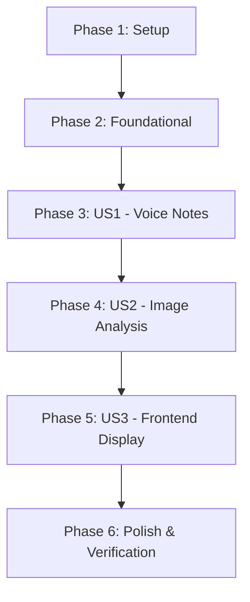

# Tasks: WhatsApp Media & AI Processing

**Input**: Design documents from `/specs/017-whatsapp-media-ai/`

**Prerequisites**: [plan.md](file:///Users/mazenelsbagh/mazen%20mac/apps/smart%20whatsapp/specs/017-whatsapp-media-ai/plan.md) (required), [spec.md](file:///Users/mazenelsbagh/mazen%20mac/apps/smart%20whatsapp/specs/017-whatsapp-media-ai/spec.md) (required), [research.md](file:///Users/mazenelsbagh/mazen%20mac/apps/smart%20whatsapp/specs/017-whatsapp-media-ai/research.md), [data-model.md](file:///Users/mazenelsbagh/mazen%20mac/apps/smart%20whatsapp/specs/017-whatsapp-media-ai/data-model.md), [contracts/webhooks.md](file:///Users/mazenelsbagh/mazen%20mac/apps/smart%20whatsapp/specs/017-whatsapp-media-ai/contracts/webhooks.md), [contracts/assets.md](file:///Users/mazenelsbagh/mazen%20mac/apps/smart%20whatsapp/specs/017-whatsapp-media-ai/contracts/assets.md)

## Spec Kit Preparation Workflow

- [x] Phase 1: Feature Specification (`speckit-specify`) completed in [spec.md](file:///Users/mazenelsbagh/mazen%20mac/apps/smart%20whatsapp/specs/017-whatsapp-media-ai/spec.md)
- [x] Phase 2: Technical Planning (`speckit-plan`) completed in [plan.md](file:///Users/mazenelsbagh/mazen%20mac/apps/smart%20whatsapp/specs/017-whatsapp-media-ai/plan.md)
- [x] Phase 3: Detailed Task Breakdown (`speckit-tasks`) completed in this file

---

## Phase 1: Setup (Shared Infrastructure)

**Purpose**: Database migration and storage checks setup.

- [x] T001 In C# class file [Message.cs](file:///Users/mazenelsbagh/mazen%20mac/apps/smart%20whatsapp/backend/src/Modules/Conversations/Domain/Message.cs), add properties `public Guid? AssetId { get; set; }` and `public string? Transcription { get; set; }`.
- [x] T002 In C# EF Core context file [AppDbContext.cs](file:///Users/mazenelsbagh/mazen%20mac/apps/smart%20whatsapp/backend/src/Shared/Infrastructure/AppDbContext.cs), configure a relationship mapping where `Message` has an optional foreign key `AssetId` referencing the `Asset` entity: `.HasOne<Modules.Media.Domain.Asset>().WithMany().HasForeignKey(m => m.AssetId).OnDelete(DeleteBehavior.SetNull);`.
- [x] T003 Generate EF Core migration by executing `dotnet ef migrations add AddMessageMediaReferences --project backend/src` inside backend folder, and apply it to database.

---

## Phase 2: Foundational (Blocking Prerequisites)

**Purpose**: Core media API endpoints in backend modular monolith.

- [x] T004 In C# controller file [AssetsController.cs](file:///Users/mazenelsbagh/mazen%20mac/apps/smart%20whatsapp/backend/src/Modules/Media/API/AssetsController.cs), add HTTP POST endpoint `/api/projects/{projectId}/assets/upload` that receives `IFormFile file` and an optional `Guid? uploadedBy`. It must call `_assetService.UploadAssetAsync(...)` to save the file and return `201 Created` with the asset details.
- [x] T005 In C# controller file [AssetsController.cs](file:///Users/mazenelsbagh/mazen%20mac/apps/smart%20whatsapp/backend/src/Modules/Media/API/AssetsController.cs), add HTTP GET endpoint `/api/projects/{projectId}/assets/{id}/url` that calls `_minIoStorageService.GetSignedUrlAsync(...)` for the asset's `StoragePath` (with 1-hour expiry) and returns `200 OK` containing the pre-signed URL.

---

## Phase 3: User Story 1 - Voice Notes Transcription & AI Auto-Reply (Priority: P1) 🎯 MVP

**Goal**: Automatically download incoming WhatsApp voice notes, upload them to Object Storage, transcribe them via Gemini 3.5 Flash's multi-modal API, save transcription, and reply.

**Independent Test**: Send a voice note, verify that it uploads to S3, gets transcribed in the DB, and the bot replies relative to the transcription.

- [x] T006 [US1] In Node.js gateway file [baileys-manager.js](file:///Users/mazenelsbagh/mazen%20mac/apps/smart%20whatsapp/whatsapp-gateway/src/baileys-manager.js), intercept `audioMessage` inside `messages.upsert` listener:
  1. Retrieve audio data using Baileys' `downloadContentFromMessage` stream tool.
  2. Read stream into a binary Buffer.
  3. POST the file buffer using `multipart/form-data` to the backend `/api/projects/${projectId}/assets/upload` endpoint.
- [x] T007 [US1] In Node.js gateway file [baileys-manager.js](file:///Users/mazenelsbagh/mazen%20mac/apps/smart%20whatsapp/whatsapp-gateway/src/baileys-manager.js), extract the `id` (assetId) from the backend asset upload response, and add it to the webhook payload object sent to `POST /api/webhooks/whatsapp/message` as `assetId`.
- [x] T008 [US1] In C# webhook receiver [WebhookController.cs](file:///Users/mazenelsbagh/mazen%20mac/apps/smart%20whatsapp/backend/src/Modules/Conversations/API/WebhookController.cs), bind `AssetId` property in the request payload `IncomingMessagePayload` class, and when saving the new `Message` object, assign `AssetId = payload.AssetId`.
- [x] T009 [US1] In C# Gemini service interface `IGeminiClient` and implementation [GeminiClient.cs](file:///Users/mazenelsbagh/mazen%20mac/apps/smart%20whatsapp/backend/src/Modules/AI/Services/GeminiClient.cs), add method overload `Task<string> GenerateReplyAsync(string messageContent, byte[] fileBytes, string mimeType, string apiKeyOverride = null)`. When calling Gemini API, construct the `contents` part JSON payload:
  - Add text prompt part.
  - Add `inlineData` part containing `{ "mimeType": mimeType, "data": Convert.ToBase64String(fileBytes) }`.
- [x] T010 [US1] In C# background worker [AIReplyWorker.cs](file:///Users/mazenelsbagh/mazen%20mac/apps/smart%20whatsapp/backend/src/Modules/AI/Workers/AIReplyWorker.cs), check if the received message has `MessageType == "Voice"` and `AssetId` is not null:
  1. Load the media file stream using `_minIoStorageService.DownloadFileAsync` for the asset's storage path.
  2. Read stream into bytes.
  3. Construct a multimodal prompt calling the new `GeminiClient.GenerateReplyAsync` overload. Include instructions: *"The attached audio is a customer's WhatsApp voice note. Transcribe it exactly in its original language, and include the transcription in your JSON response under the 'transcription' key."*
  4. Update [AIMarketingBrain.cs](file:///Users/mazenelsbagh/mazen%20mac/apps/smart%20whatsapp/backend/src/Modules/AI/Services/AIMarketingBrain.cs)'s JSON format guidelines to support extracting `"transcription": "string | null"`.
  5. Save the transcription to the C# `Message.Transcription` field in the database.

---

## Phase 4: User Story 2 - Image/Document Fact Extraction (Priority: P1)

**Goal**: Intercept WhatsApp image messages, upload to Object Storage, extract details/CRM properties using Gemini multimodal analysis, and suggest CRM updates.

**Independent Test**: Send an invoice or receipt image, verify that S3 storage registers it, Gemini parses it, and CRM suggestions are registered.

- [x] T011 [US2] In Node.js gateway file [baileys-manager.js](file:///Users/mazenelsbagh/mazen%20mac/apps/smart%20whatsapp/whatsapp-gateway/src/baileys-manager.js), intercept `imageMessage` inside `messages.upsert` listener, download image bytes using Baileys stream tools, and upload to the backend asset upload endpoint.
- [x] T012 [US2] In Node.js gateway file [baileys-manager.js](file:///Users/mazenelsbagh/mazen%20mac/apps/smart%20whatsapp/whatsapp-gateway/src/baileys-manager.js), once the upload is complete, forward the returned `assetId` as `assetId` and set `messageType = "Image"` in the webhook payload.
- [x] T013 [US2] In C# asset manager [AssetService.cs](file:///Users/mazenelsbagh/mazen%20mac/apps/smart%20whatsapp/backend/src/Modules/Media/Services/AssetService.cs), if the uploaded file has image MIME types (e.g. image/jpeg, image/png):
  1. Call `_imageTransformer.CreateThumbnailAsync` to generate a 150x150 thumbnail stream.
  2. Upload the thumbnail to MinIO S3 under partitioned folder `projects/{projectId}/assets/variants/`.
  3. Create an `AssetVariant` record linked to the parent `Asset` with `VariantType = Thumbnail`.
- [x] T014 [US2] In C# background worker [AIReplyWorker.cs](file:///Users/mazenelsbagh/mazen%20mac/apps/smart%20whatsapp/backend/src/Modules/AI/Workers/AIReplyWorker.cs), if the incoming message has `MessageType == "Image"` and `AssetId` is not null:
  1. Download the image bytes from MinIO storage.
  2. Call the multimodal `GeminiClient.GenerateReplyAsync` overload with the image bytes and MIME type.
  3. Instruct Gemini to analyze the image content to extract relevant details (e.g. billing values, City, budget, tags) and map them into the CRM updates payload.

---

## Phase 5: User Story 3 - Frontend Timeline & Audio Playback (Priority: P2)

**Goal**: Render images with clickable previews and voice notes with playbars in the React Frontend chat bubble window.

**Independent Test**: Load chat inbox in the frontend, verify images render previews and audio plays voice messages via pre-signed S3 links.

- [x] T015 [P] [US3] [Package] In React chat component [Inbox.tsx](file:///Users/mazenelsbagh/mazen%20mac/apps/smart%20whatsapp/frontend/src/packages/inbox/Inbox.tsx), update message object structures to include `assetId` (string/null) and `transcription` (string/null).
- [x] T016 [P] [US3] [Shared Component] In React inbox component, implement an asynchronous function or helper hook `fetchAssetUrl(assetId)` that calls `GET /api/projects/${projectId}/assets/${assetId}/url`, storing the resulting pre-signed S3 URL in a local cache/state mapping.
- [x] T017 [US3] [Component] In React chat bubble rendering logic inside [Inbox.tsx](file:///Users/mazenelsbagh/mazen%20mac/apps/smart%20whatsapp/frontend/src/packages/inbox/Inbox.tsx):
  - If `messageType === "Image"` and `assetId` is present: Retrieve the signed S3 URL using `fetchAssetUrl`, and render a styled `` tag with click-to-expand popup features.
  - If `messageType === "Voice"` and `assetId` is present: Retrieve the signed S3 URL, and render a standard HTML5 `<audio controls />` playbar. Display the stored `transcription` below the playbar inside an elegant container.
- [x] T018 [P] [US3] [Component] Update CSS stylesheets [inbox.module.css](file:///Users/mazenelsbagh/mazen%20mac/apps/smart%20whatsapp/frontend/src/packages/inbox/inbox.module.css) to add classes for image previews (rounded corners, shadow, hover micro-animations) and the audio player layout.

---

## Phase 6: Polish & Cross-Cutting Concerns

**Purpose**: Test mocks, automated verification, and build validation.

- [x] T019 In C# mock generator [GeminiClient.cs](file:///Users/mazenelsbagh/mazen%20mac/apps/smart%20whatsapp/backend/src/Modules/AI/Services/GeminiClient.cs), update mock checks so that if a mock API key is present:
  - If the prompt contains multimodal voice note data, return mock JSON including `"transcription": "تفاصيل حجز الكورس والمواعيد"`.
  - If the prompt contains image data, return mock JSON with relevant extracted CRM details.
- [x] T020 In Python test suite, create integration test file `tests/phase_5/test_whatsapp_media_ai.py` that:
  - Tests asset upload endpoint with files.
  - Mocks the Baileys webhook payload containing `assetId`.
  - Asserts that the backend indexes the media message, executes multimodal mock replies, saves the transcription, and generates secure pre-signed URLs.
- [x] T021 Run `pytest tests/phase_5/test_whatsapp_media_ai.py` to verify the integration tests pass cleanly.
- [x] T022 Rebuild frontend and backend containers: `docker compose up -d --build backend frontend whatsapp-gateway` and verify zero compilation warnings.

---

## Dependencies & Execution Order

### Phase Dependencies

- **Foundational (Phase 2)**: Database migrations and endpoints must be ready before gateway integrations.
- **US1 & US2**: Multimodal gateway uploads must be implemented before AI extraction testing.
- **US3**: Backend assets must be served before frontend components can read and render them.
